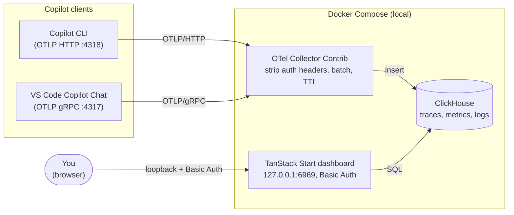

# ghcp-monitoring

> Self-hosted, local-first observability for **GitHub Copilot CLI & Copilot Chat** - token usage, latency, sessions, tool calls, and estimated cost, all on your own machine.

[](LICENSE)
[](https://opentelemetry.io/)
[](https://clickhouse.com/)
[](https://tanstack.com/start/latest)

`ghcp-monitoring` is a containerized OpenTelemetry stack that captures the
telemetry GitHub Copilot already emits and turns it into a private analytics
dashboard. Nothing leaves your machine: Copilot sends OTLP to a local
collector, the collector strips auth headers and writes every signal to a
persistent **ClickHouse** store, and a purpose-built **TanStack Start**
dashboard renders 13 panels over that data.

It follows the official
[Microsoft Copilot monitoring guide](https://github.com/microsoft/vscode-copilot-chat/blob/main/docs/monitoring/agent_monitoring.md)
but ships safer local-first defaults: loopback-only binds, Basic Auth, bounded
retention, content capture **off** by default, and a reveal-on-click UX for any
sensitive content you do choose to capture.

---

## Architecture



**Layered design:** collect -> persist -> visualize. The collector is the single
ingress (ADR-0001), ClickHouse is the single OLAP store (ADR-0005), and the
dashboard reads it over plain SQL (ADR-0006). Each layer is replaceable.

---

## Features

- **13 analytics panels** - totals, trends, by-model, by-agent, per-call table,
  sessions (list + timeline), cache efficiency, latency percentiles,
  time-to-first-token, tool calls, hourly heatmap, finish reasons, plus raw
  trace and log explorers.
- **Estimated cost** - token counts are priced against a bundled
  [litellm](https://github.com/BerriAI/litellm) model price snapshot.
- **Persistent** - telemetry survives restarts on a named ClickHouse volume;
  retention is bounded by `RETENTION_DAYS` (default 90).
- **Private by default** - loopback binds, HTTP Basic Auth, content capture
  off, auth headers scrubbed at the collector, captured content rendered behind
  a `[redacted]` reveal-on-click cell.
- **Hardened containers** - non-root users, `cap_drop: ALL`,
  `no-new-privileges`, read-only root filesystems, digest-pinned images.
- **One-command quality gate** - `bash scripts/validate.sh all` lints compose,
  YAML, and shell, and a `connectivity` smoke test proves the full
  receive -> persist -> render path.
- **Windows covered** - the CI workflow has a `windows-latest` dashboard job
  and validates `scripts/setup-terminal.ps1`.

---

## Quick start

```bash
git clone https://github.com/ytthuan/ghcp-monitoring.git
cd ghcp-monitoring
cp .env.example .env                 # then edit CLICKHOUSE_PASSWORD to a strong value
docker compose up -d                 # collector + ClickHouse + dashboard
source scripts/setup-terminal.sh     # point this shell's Copilot CLI at the collector
```

On Windows PowerShell, use the native helper instead of `source`:

```powershell
git clone https://github.com/ytthuan/ghcp-monitoring.git
cd ghcp-monitoring
Copy-Item .env.example .env          # then edit CLICKHOUSE_PASSWORD
docker compose up -d
.\scripts\setup-terminal.ps1
```

Open **<http://127.0.0.1:6969>** and log in with the `DASHBOARD_USER` /
`DASHBOARD_PASSWORD` from your `.env` (default `admin` / `admin` - rotate it).
Run a Copilot CLI command in the sourced shell and the `/calls` panel populates
within seconds.

---

## Step-by-step setup

### 1. Prerequisites

| Tool | Version | Notes |
|---|---|---|
| Docker + Docker Compose | v2 | Docker Desktop on Windows/macOS, Docker Engine on Linux |
| Node.js | >= 22 | only for dashboard development |
| pnpm | 9.15.0 | only for dashboard development (`corepack enable`) |
| GitHub Copilot CLI and/or VS Code Copilot Chat | latest | the telemetry source |

The stack itself needs only Docker. Node/pnpm are required only if you want to
run the dashboard outside its container (`pnpm --dir apps/dashboard dev`).
Windows users should run the stack from PowerShell, Windows Terminal, or WSL2.
The published container paths are relative (`./config/...`), so Docker Desktop
for Windows handles the bind mounts without host-specific path edits.

### 2. Bring up the stack

```bash
cp .env.example .env
```

Windows PowerShell:

```powershell
Copy-Item .env.example .env
```

Edit `.env` and set a strong `CLICKHOUSE_PASSWORD` - the placeholder is
intentionally invalid and the stack will refuse to start without a real one.
Then:

```bash
docker compose up -d
docker compose ps        # clickhouse should report "healthy"
```

Services come up loopback-only:

| Service | Address | Purpose |
|---|---|---|
| OTel Collector (HTTP) | `127.0.0.1:4318` | Copilot CLI OTLP endpoint |
| OTel Collector (gRPC) | `127.0.0.1:4317` | VS Code Copilot Chat endpoint |
| Collector health | `127.0.0.1:13133` | liveness probe |
| ClickHouse | `127.0.0.1:8123` | OLAP store (dev parity only) |
| Dashboard | `127.0.0.1:6969` | the UI |

### 3. Wire up Copilot

The stack has two OpenTelemetry receivers:

| Receiver | URL | Use for |
|---|---|---|
| OTLP HTTP | `http://127.0.0.1:4318` | Copilot CLI terminal telemetry |
| OTLP gRPC | `http://127.0.0.1:4317` | VS Code Copilot Chat telemetry |

**Copilot CLI (terminal):** run the helper in each shell that runs Copilot.
`.env` configures containers, not your shell.

macOS/Linux Bash, Zsh, or Git Bash:

```bash
source scripts/setup-terminal.sh
env | grep -E '^(COPILOT_OTEL|OTEL_EXPORTER_OTLP|OTEL_SERVICE_NAME)'
```

Windows PowerShell:

```powershell
.\scripts\setup-terminal.ps1
Get-ChildItem Env:COPILOT_OTEL*, Env:OTEL_EXPORTER_OTLP*, Env:OTEL_SERVICE_NAME
```

This exports `COPILOT_OTEL_ENABLED=true`,
`COPILOT_OTEL_CAPTURE_CONTENT=false`,
`OTEL_EXPORTER_OTLP_ENDPOINT=http://127.0.0.1:4318`, and
`OTEL_EXPORTER_OTLP_PROTOCOL=http/protobuf`. Re-run it after every shell
restart. If PowerShell blocks local scripts, run
`Set-ExecutionPolicy -Scope Process Bypass` in that terminal first.

If you prefer to set the variables manually, use these exact values for
Copilot CLI:

```bash
export COPILOT_OTEL_ENABLED=true
export COPILOT_OTEL_CAPTURE_CONTENT=false
export OTEL_EXPORTER_OTLP_ENDPOINT=http://127.0.0.1:4318
export OTEL_EXPORTER_OTLP_PROTOCOL=http/protobuf
export OTEL_SERVICE_NAME=github-copilot
```

Windows PowerShell equivalent:

```powershell
$env:COPILOT_OTEL_ENABLED = "true"
$env:COPILOT_OTEL_CAPTURE_CONTENT = "false"
$env:OTEL_EXPORTER_OTLP_ENDPOINT = "http://127.0.0.1:4318"
$env:OTEL_EXPORTER_OTLP_PROTOCOL = "http/protobuf"
$env:OTEL_SERVICE_NAME = "github-copilot"
```

**VS Code Copilot Chat:** add to your settings JSON (default exporter is gRPC
on `4317`):

```json
{
  "github.copilot.chat.otel.enabled": true,
  "github.copilot.chat.otel.exporterType": "otlp-grpc",
  "github.copilot.chat.otel.otlpEndpoint": "http://127.0.0.1:4317",
  "github.copilot.chat.otel.captureContent": false
}
```

The collector listens on both ports, so CLI and Chat can run side by side.

### 4. Open the dashboard

Browse to **<http://127.0.0.1:6969>** and sign in with the Basic Auth
credentials from `.env`. Send a Copilot request, then click **Refresh data**.
Empty state is correct on a fresh stack - panels fill as telemetry arrives.

Verify the end-to-end path any time:

```bash
bash scripts/validate.sh connectivity
```

On Windows, run validation from WSL2 or Git Bash:

```bash
bash scripts/validate.sh connectivity
```

This posts an OTLP smoke trace, polls ClickHouse for it, probes ClickHouse
`/ping`, and checks the dashboard health endpoint.

---

## Configuration

Copy `.env.example` to `.env` before starting Docker Compose. The `.env` file
configures the containers and supplies the terminal helper defaults; it does
**not** automatically change environment variables in already-open shells.

### Docker / stack variables

| Variable | Default | Purpose |
|---|---|---|
| `CLICKHOUSE_USER` / `CLICKHOUSE_PASSWORD` / `CLICKHOUSE_DB` | `copilot` / _invalid_ / `copilot_telemetry` | ClickHouse credentials - **set a strong password** |
| `RETENTION_DAYS` | `90` | telemetry retention (TTL on exporter + materialized views) |
| `DASHBOARD_PORT` | `6969` | dashboard host port |
| `DASHBOARD_BIND_HOST` | `127.0.0.1` | set to `0.0.0.0` / a NIC IP to expose on LAN (**rotate the password first**) |
| `DASHBOARD_USER` / `DASHBOARD_PASSWORD` | `admin` / `admin` | dashboard Basic Auth - **rotate before any LAN bind** |
| `OTEL_BIND_HOST` | `127.0.0.1` | collector bind host (LAN exposure is opt-in) |
| `OTEL_GRPC_PORT` / `OTEL_HTTP_PORT` / `OTEL_HEALTH_PORT` | `4317` / `4318` / `13133` | collector ports |
| `APPLICATIONINSIGHTS_CONNECTION_STRING` | empty | reserved for a future opt-in cloud exporter; leave blank for local-only telemetry |
| `DASHBOARD_DEFAULT_RANGE` / `DASHBOARD_DEFAULT_GRANULARITY` | `7d` / `1h` | initial filter state |

### Copilot CLI / OpenTelemetry variables

These variables must be present in the terminal process that launches Copilot
CLI. Use `source scripts/setup-terminal.sh`, `.\scripts\setup-terminal.ps1`, or
set them manually:

| Variable | Default | Purpose |
|---|---|---|
| `COPILOT_OTEL_ENABLED` | `true` | enable Copilot CLI telemetry |
| `COPILOT_OTEL_CAPTURE_CONTENT` | `false` | **keep false** unless debugging in a trusted session |
| `OTEL_EXPORTER_OTLP_ENDPOINT` | `http://127.0.0.1:4318` | OTLP HTTP collector endpoint for Copilot CLI |
| `OTEL_EXPORTER_OTLP_PROTOCOL` | `http/protobuf` | protocol required by Copilot CLI for OTLP HTTP |
| `OTEL_SERVICE_NAME` | `github-copilot` | service name shown in ClickHouse/dashboard data |

For Windows terminal sessions, `scripts/setup-terminal.ps1` sets the same
Copilot environment variables as `scripts/setup-terminal.sh`.

---

## Security

This is a **local-first** stack. The defaults assume loopback only.

- **Loopback by default.** Dashboard and collector bind to `127.0.0.1`;
  ClickHouse is loopback-only by design (ADR-0004).
- **Content capture is off.** `COPILOT_OTEL_CAPTURE_CONTENT=false` means
  prompts, code, file paths, and secrets are never emitted. If you opt in, the
  dashboard shows a `[redacted]` placeholder with reveal-on-click and a warning
  banner; the reveal flag lives in `sessionStorage` only.
- **Auth headers are scrubbed** at the collector before any exporter runs.
- **Before exposing on a LAN:** rotate `DASHBOARD_PASSWORD` and
  `CLICKHOUSE_PASSWORD`, put a TLS reverse proxy in front of the dashboard, and
  re-run `bash scripts/validate.sh all` + `gitleaks detect`.

See [`SECURITY.md`](SECURITY.md) for the disclosure policy and the operator
hardening checklist, and [`docs/monitoring/README.md`](docs/monitoring/README.md)
for the full runtime threat model.

---

## Project structure

```text
.
|-- apps/dashboard/        # TanStack Start + shadcn/ui dashboard (the UI)
|-- config/                # OTel collector + ClickHouse configs
|   `-- otelcol-copilot.yaml
|-- docs/
|   |-- adr/               # architecture decision records (ADR-0000..0006)
|   |-- monitoring/        # runtime guide + threat model
|   `-- runbooks/          # operational runbooks
|-- scripts/               # setup-terminal.sh, validate.sh, maintenance
|-- docker-compose.yml     # collector + ClickHouse + dashboard
|-- .env.example           # copy to .env
`-- AGENTS.md              # agent project memory / governance
```

---

## Development

```bash
pnpm --dir apps/dashboard install
pnpm --dir apps/dashboard dev          # dashboard on http://127.0.0.1:3000

pnpm --dir apps/dashboard typecheck
pnpm --dir apps/dashboard test:unit
pnpm --dir apps/dashboard build

bash scripts/validate.sh all           # compose + yaml + shell + agents
```

The dashboard dev server reads ClickHouse credentials from the repo-root
`.env`; bring the Docker stack up first so it has data to read.
On Windows, use PowerShell for Docker and Copilot CLI setup, and use WSL2 or
Git Bash for Bash-only validation scripts.

---

## Architecture decisions

| ADR | Decision |
|---|---|
| [ADR-0001](docs/adr/0001-otel-collector-ingress.md) | OTel Collector as the single ingress |
| [ADR-0004](docs/adr/0004-dashboard-exposure.md) | Loopback-default exposure, opt-in LAN bind |
| [ADR-0005](docs/adr/0005-clickhouse-persistence.md) | ClickHouse as the single persistent OLAP store |
| [ADR-0006](docs/adr/0006-tanstack-dashboard.md) | TanStack Start dashboard as the primary UI |

---

## Contributing

Contributions are welcome - see [`CONTRIBUTING.md`](CONTRIBUTING.md) for the
development workflow, quality gates, and commit conventions. By participating
you agree to the [Code of Conduct](CODE_OF_CONDUCT.md).

## License

[MIT](LICENSE) (c) ghcp-monitoring contributors.

## Acknowledgments

- The [Microsoft Copilot monitoring guide](https://github.com/microsoft/vscode-copilot-chat/blob/main/docs/monitoring/agent_monitoring.md)
  for the telemetry schema this stack is built around.
- [OpenTelemetry](https://opentelemetry.io/),
  [ClickHouse](https://clickhouse.com/), and
  [TanStack Start](https://tanstack.com/start/latest).
- [litellm](https://github.com/BerriAI/litellm) for the model price data used in
  cost estimates (see [`NOTICE`](NOTICE)).
